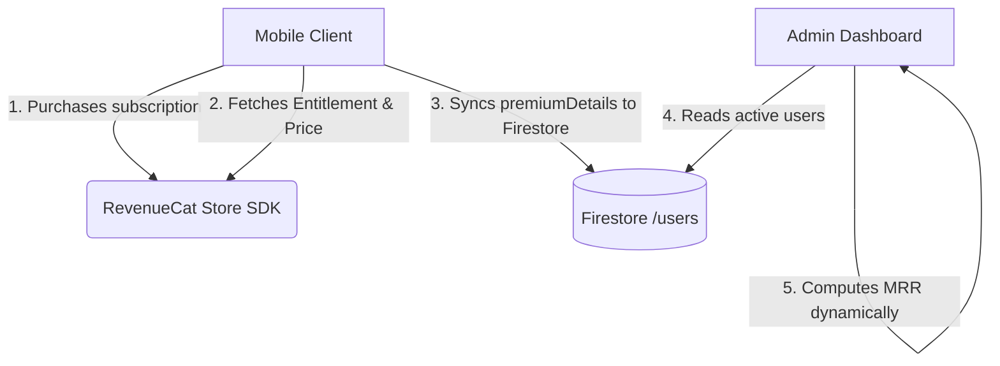

# Flutter + React Cross-Platform App Architecture

A generalized engineering blueprint distilled from a real production codebase (a Flutter mobile app with companion React web admin panel). Use it to bootstrap new projects or to bring existing ones in line with these patterns — not as a rigid spec, but as a set of defaults that are known to work well together and that mirror each other across platforms (mobile app and web admin share design tokens, naming, and structural philosophy).

Treat every section below as a **default to adapt**, not a hardcoded requirement. Item counts, names, color tokens, and specific feature folders in the original source are illustrative — swap them for whatever the user's actual project needs, while keeping the underlying pattern intact.

## When to go deeper

This file covers the architecture at a level enough to start building immediately. For implementation-level detail, read the matching reference file before writing code:

| Topic | Read this when... |
|---|---|
| `references/tab-bar-animation.md` | Building any animated/custom bottom tab bar — drag math, Bezier blob morphing, style variants |
| `references/firebase-crashlytics.md` | Wiring up crash reporting — Dart error boundaries, Android Gradle, iOS Xcode build phases |
| `references/tailwind-v4-setup.md` | Setting up Tailwind CSS v4 in a Vite/React project — v4 has no config file, unlike v3 |
| `references/responsive-strategy.md` | Implementing responsive scaling for Flutter (320px+) or the web admin panel |
| `references/toolchain-versions.md` | Picking dependency/toolchain versions for a new Flutter project (Gradle, Kotlin, package pins) |

Read only what's relevant to the current task — don't load every reference for a question about one piece.

---

## 1. Flutter Project Structure (Layered Architecture)

Use a layered structure that separates UI, state, and data so features stay testable and swappable:

```
lib/
├── core/
│   ├── navigation/        # GoRouter setup, shell transitions
│   ├── theme/             # Light & dark tokens, asset bindings
│   ├── providers/         # Global provider configs (auth, prefs)
│   └── widgets/           # Global reusable widgets
├── data/
│   ├── local/             # Drift SQLite DB, DAOs
│   └── models/            # Serialization, domain models
├── features/              # One directory per feature
│   ├── home/
│   ├── calendar/
│   └── settings/
└── l10n/                  # Localization ARB files
```

**Layer responsibilities:**
- **UI**: `ConsumerWidget` / `ConsumerStatefulWidget`, consuming Riverpod providers. Shared widgets live in `core/widgets/`; feature-local widgets stay inside their feature folder.
- **Logic**: Riverpod with code generation (`@riverpod`). Owns state updates, caching, and auth reactions.
- **Data**: split by shape of data —
  - **Drift (SQLite)** for structured, queryable local data.
  - **SharedPreferences** for simple key-value settings (locale, theme, onboarding flags).
  - **Firestore + Firebase Auth** for cloud sync/backup and premium features.

This split matters because it lets you swap the persistence mechanism (e.g. SQLite → server sync) without touching UI code, and keeps Riverpod providers thin and testable.

## 2. Navigation (GoRouter)

Use GoRouter for declarative, URL-based routing with centralized guards rather than scattering auth/onboarding checks across individual screens.

**Guard pattern** — a single `RouterTransitionNotifier` reacts to state changes and redirects:
- **Onboarding guard**: incomplete onboarding → force `/onboarding`.
- **Auth/lock guard**: app-lock enabled + not authenticated → force `/lock`.
- **Premium guard**: gated features (e.g. notification settings) → redirect non-premium users to `/settings/subscribe`.

**Shell navigation without "sliding through" intermediate tabs**: when a `ShellRoute` wraps top-level tabs in a `PageView`-backed shell, jumping from tab 1 to tab 5 directly would visually slide through 2, 3, 4. Avoid this by:
1. Intercepting the navigation request.
2. If the jump distance > 1, temporarily swap the *adjacent* page in the `PageView` list for the *target* page.
3. Animate to the adjacent index (which now renders the target).
4. On completion, instantly jump the `PageController` to the real target index and restore original page order — invisibly, since the displayed content didn't change.

## 3. Custom Animated Tab Bar

Don't reach for default Material/Cupertino tab bars when the project wants a distinctive nav. Build a `CustomTabBar` that supports three interchangeable presentation styles (pick based on brand):

- **Glassmorphic liquid** (most distinctive): `BackdropFilter` blur + a Bezier-drawn liquid droplet indicator that stretches toward drag direction.
- **Normal/translucent**: simple translucent background, indicator is a rounded pill sliding behind the active tab.
- **Solid flat**: opaque background, indicator simplified to a dot or underline — best for minimal/classic designs.

Core interaction: a `GestureDetector` maps horizontal drag position to a continuous tab index (e.g. `0.0`–`4.0` for 5 tabs); during drag the indicator follows the touch directly and the page view scroll locks; on release, snap to the nearest index with an eased animation (~`380ms`, `Curves.easeOutQuad`).

See `references/tab-bar-animation.md` for the full Bezier math, velocity-based stretch calculation, and icon-scaling detail — read it before implementing any version of this component.

## 4. Mobile Responsiveness

Use a fixed virtual design width (e.g. `390px`) and scale the whole UI to it via `responsive_framework`, rather than hand-tuning breakpoints per widget. This keeps text, padding, and tap targets proportional from `320px` phones up through tablets, and avoids overflow banners.

```dart
builder: (context, child) => ResponsiveBreakpoints.builder(
  child: Builder(
    builder: (context) {
      final isMobile = ResponsiveBreakpoints.of(context).isMobile;
      final scaledChild = isMobile
          ? ResponsiveScaledBox(width: 390, child: child!)
          : child!;
      return Directionality(textDirection: TextDirection.ltr, child: scaledChild);
    },
  ),
  breakpoints: [
    const Breakpoint(start: 0, end: 450, name: MOBILE),
    const Breakpoint(start: 451, end: 800, name: TABLET),
    const Breakpoint(start: 801, end: 1920, name: DESKTOP),
  ],
)
```

Full breakdown (including the web admin panel's parallel responsive strategy) is in `references/responsive-strategy.md`.

## 5. Overflow Prevention

Default to these patterns any time a widget might receive more content than its parent can comfortably hold — this prevents the red/yellow overflow banners far more reliably than ad-hoc fixes:

- **`FittedBox(fit: BoxFit.scaleDown)`** around text/labels inside constrained cards or buttons — shrinks rather than clips.
- **`Flexible` / `Expanded`** for any text-bearing child inside a `Row`/`Column` — unbounded children are the most common overflow cause.
- **`LayoutBuilder`** or **`FractionallySizedBox`** for layouts that need to size relative to their parent (custom cards, charts).

## 6. Theme-Driven Design (No Hardcoded Styles)

Every visual value — color, radius, spacing, font — should resolve from one centralized theme config (e.g. `lib/core/theme/app_theme.dart`). Never inline hex codes or magic numbers in feature widgets; this is what lets the same visual system drive both the Flutter app and the React admin panel.

**Token categories to define:**
- `systemBG`, `systemBGSurface`, `systemBGElevated` — background and elevation layers.
- `brandAccent`, `brandPrimary` — primary brand/action colors.
- Semantic feedback colors — success/warning/info/error.
- Typography — pick a typeface family matching the product's personality (geometric/clean vs. rounded/friendly), declared once, used everywhere.
- Geometric tokens — `radiusSM/MD/LG/XL` and an 8pt spacing grid.

## 7. Custom Vector Assets Only

Forbid raw emoji, generic Material icons, and unicode symbols in product UI — they undercut a premium/branded feel. Instead:

- Define every icon/illustration as an SVG string constant in one file (e.g. `lib/core/theme/app_assets.dart`), rendered via `SvgPicture.string(...)`.
- Use `currentColor` or opacity parameters in the SVG so icons inherit parent color/animation state automatically (important for active-tab color interpolation, etc.).
- Group by purpose: decorative icons, action/navigation glyphs, larger illustrations for empty states/onboarding.

## 8. Firebase & Native Crash Reporting

Wire up both Dart-level and native-level error capture from day one — see `references/firebase-crashlytics.md` for the full `main()` setup, Android Gradle Kotlin DSL plugin block, and the iOS Xcode Run Script build phase (with exact input paths) needed for dSYM symbolication.

## 9. React Web Admin Panel (Vite + Tailwind v4)

When the companion web admin panel is React, default to **Vite + TypeScript + Tailwind CSS v4** rather than CRA or Tailwind v3 — v4 drops the `tailwind.config.js` file entirely in favor of an `@theme` block in CSS, which makes it much easier to mirror the Flutter app's design tokens directly (e.g. `--color-brand-accent: var(--app-accent-color)`). Full setup steps, including the Vite plugin and CSS import change, are in `references/tailwind-v4-setup.md`.

For the admin layout itself: flex-row sidebar + main content, sidebar collapses to an overlay under `768px`, card grids step down via `grid-cols-1 → md:grid-cols-2 → lg:grid-cols-3`, and tight breakpoints (`max-width: 480px`) shrink wrapper padding to `16px` to preserve usable space on small screens.

## 10. Toolchain & Dependency Defaults

When scaffolding a new Flutter project in this style, check `references/toolchain-versions.md` for the pinned Gradle/Kotlin/AGP versions and the known-stable version ranges for `firebase_core`, `flutter_riverpod`, `drift`, `go_router`, and `responsive_framework`. Treat these as a starting point — verify against current released versions if the project is starting fresh, since pins age quickly.

---

## 11. Directory Structure Blueprint

A unified codebase structure holding both the mobile client and the web admin portal in a single repository:

```text
├── pubspec.yaml                 # Mobile application configuration & versioning
├── firebase.json                # Shared Firebase rules/options
├── firestore.rules              # Central security rules for Firestore access
├── scripts/
│   └── sync-version.js          # Automation script for version and changelog sync
├── android/
│   └── fastlane/
│       ├── Fastfile             # Android release pipeline configuration
│       └── metadata/            # Play Store localized store listings & changelogs
└── admin/                       # Web Admin Panel (React + Vite + TypeScript)
    ├── package.json
    ├── firebase.json            # Admin hosting configuration
    └── src/
        ├── firebase.ts          # Admin Firebase client SDK initialization
        └── components/          # Dashboard components (Overview, Announcements, etc.)
```

---

## 12. In-App Updates & Version Control

An automated system to push updates and control delivery style (Flexible vs. Immediate/Forced) without hardcoded codebases.

> [!WARNING]
> **Never hardcode version numbers** in any update-checking files or logic. Always query the version dynamically (e.g., using `package_info_plus` on the client or reading from your project configurations/metadata automatically via build/sync hooks).

### Mobile Client Implementation (Flutter)
1. **Dependency**: Use the native Play Core update wrapper: `in_app_update_flutter`.
2. **Logic**:
   - On app startup, read update metadata from Firestore document `/config/app_update`.
   - Read the local version dynamically using `package_info_plus`.
   - Call the update library's update availability check.
   - If an update is available:
     - **Immediate (Forced)**: Blocks user interaction, prompts a full-screen Google Play interface.
     - **Flexible (Background)**: Prompts an optional banner, downloads in the background, and prompts completion.

### Admin Dashboard Implementation
- Displays the active store version and release notes synced from Fastlane (view-only).
- Exposes card-options to toggle the release policy (`updateType: 'flexible' | 'immediate'`).
- Saves these controls back to Firestore, notifying clients instantly.

---

## 13. Dynamic Revenue & Billing Analytics (RevenueCat)

Tracks and aggregates Estimated MRR and active subscription counts without backend services or exposing private client API keys.



### Mobile Client Implementation (Flutter)
1. **Entitlement Extraction**: Fetch `CustomerInfo` and locate the active entitlement:
   ```dart
   final active = info.entitlements.active['premium'];
   final productId = active.productIdentifier;
   ```
2. **Pricing Lookups**: Traverse `Purchases.getOfferings()` available packages to obtain the exact price and currency:
   ```dart
   double? price;
   final offerings = await Purchases.getOfferings();
   if (offerings?.current != null) {
     for (final pkg in offerings.current.availablePackages) {
       if (pkg.storeProduct.identifier == productId) {
         price = pkg.storeProduct.price;
       }
     }
   }
   ```
3. **Sync to Firestore**: Save a `premiumDetails` map containing `isPremium`, `productId`, `period` ('monthly' | 'yearly'), and the actual `price` to `/users/{uid}`. Do not specify fallback default prices on the client to avoid skewing data when offline.

> [!IMPORTANT]
> **Never hardcode pricing information or plan prices** (e.g., "$4.99" or "$2.83") anywhere in the mobile client or admin dashboard code. Always retrieve actual prices dynamically from the billing provider (e.g., RevenueCat SDK). If the data is unavailable (e.g., client offline or legacy sync delays), fall back to an empty state indicator (like `--` or `N/A`) rather than using default fallback values.

### Admin Dashboard Implementation (React)
- Load the total user list from Firestore.
- Iterate and aggregate MRR:
  - Add monthly prices directly: `monthlyRevenue += price`.
  - Divide annual prices by 12: `yearlyRevenue += price`.
- If no pricing data is synced (e.g., offline or legacy users), count the user but render `--` or `N/A` for Estimated MRR rather than using hardcoded values.

---

## 14. Broadcasts & Announcements System

Allows administrators to compose and push rich marketing banners or functional announcements target-filtered by platform or status.

### Mobile Client Implementation (Flutter)
1. **Local Caching**: The client listens for the latest announcement document in Firestore under `/announcements`.
2. **Deduplication Check**: Store the last seen announcement ID locally using `SharedPreferences`.
3. **Target Auditing**: Check if the client matches target criteria (e.g. `targetPlatform` matches or `targetPremium` matches status) before displaying.
4. **Display**: Trigger an overlay dialog displaying custom actions and copy.

### Admin Dashboard Implementation
- Contains an announcement composer editor.
- Generates a preview mimicking real iOS and Android alert frames.
- Saves the payload containing targeting arrays, titles, bodies, action URLs, and timestamps to the `/announcements` collection.

---

## 15. User Management & Admin Whitelisting

Central overview of accounts, profile metadata, client versions, and administrative privileges.

### Admin Whitelist & Rules (`firestore.rules`)
Configure a helper function in your security rules to whitelist specific admin emails or domains. Only whitelisted users can write to global configs (`/config`, `/announcements`, `/glossary`) or read user profiles:

```javascript
rules_version = '2';
service cloud.firestore {
  match /databases/{database}/documents {
    function isAdmin() {
      return request.auth != null && 
        (request.auth.token.email == 'admin@yourdomain.com' || 
         request.auth.token.email.matches('.*@yourdomain\\.com$'));
    }

    match /config/{document=**} {
      allow read: if true;
      allow write: if isAdmin();
    }
    match /users/{userId} {
      allow read, write: if isAdmin() || (request.auth != null && request.auth.uid == userId);
    }
  }
}
```

---

## 16. Version Sync Automation (`sync-version.js`)

A build hook running on the developer's machine that extracts app version parameters and updates the web portal configuration.

```javascript
const fs = require('fs');
const path = require('path');
const { execSync } = require('child_process');

try {
  // 1. Read Flutter version and build number from pubspec.yaml
  const pubspecContent = fs.readFileSync(path.join(__dirname, '../pubspec.yaml'), 'utf8');
  const versionMatch = pubspecContent.match(/^version:\s*([^\s+]+)(?:\+([^\s]+))?/m);
  const version = versionMatch[1].trim();
  const versionCode = versionMatch[2] ? versionMatch[2].trim() : null;

  // 2. Resolve Changelog from Fastlane metadata files
  let changelog = '';
  const changelogsDir = path.join(__dirname, '../android/fastlane/metadata/android/en-US/changelogs');
  const specificChangelogPath = versionCode ? path.join(changelogsDir, `${versionCode}.txt`) : null;
  const defaultChangelogPath = path.join(changelogsDir, 'default.txt');

  if (specificChangelogPath && fs.existsSync(specificChangelogPath)) {
    changelog = fs.readFileSync(specificChangelogPath, 'utf8').trim();
  } else if (fs.existsSync(defaultChangelogPath)) {
    changelog = fs.readFileSync(defaultChangelogPath, 'utf8').trim();
  } else {
    changelog = 'Minor improvements and bug fixes.';
  }

  // 3. Write Config export for Admin build
  const fileContent = `// Automatically generated by sync-version.js. Do not edit.\nexport const DEFAULT_LATEST_VERSION = '${version}';\nexport const DEFAULT_CHANGELOG = ${JSON.stringify(changelog)};\n`;
  fs.writeFileSync(path.join(__dirname, '../admin/src/config/version.ts'), fileContent, 'utf8');

  // 4. Compile React App
  execSync('npm run build', { cwd: path.join(__dirname, '../admin'), stdio: 'inherit' });

  // 5. Deploy Hosting
  execSync('npx firebase deploy --only hosting --project your-project-id', { cwd: path.join(__dirname, '../admin'), stdio: 'inherit' });

} catch (error) {
  console.error('Sync failure:', error.message);
  process.exit(1);
}
```

---

## 17. Fastlane Setup & Deployment Pipeline

Automates binary distribution to app stores and automatically triggers our version sync hook.

### Directory Structure
```text
android/fastlane/
├── Appfile                  # Configures app identifier and service account JSON path
└── Fastfile                 # Automation lanes
```

### Lane Hooking (`Fastfile` Blueprint)
Add the `sync-version.js` script trigger to your Fastlane lane:

```ruby
default_platform(:android)

platform :android do
  desc "Submit a new Beta Build to Google Play alpha track"
  lane :alpha do
    # 1. Trigger local sync script before compiling/uploading binaries
    sh("node ../scripts/sync-version.js")

    # 2. Upload binary to Play Store
    upload_to_play_store(
      track: 'alpha',
      release_status: 'completed',
      skip_upload_apk: true,
      skip_upload_aab: false,
      aab: '../build/app/outputs/bundle/release/app-release.aab'
    )
  end
end
```

---

## 18. Firestore Security Rules Configuration & Publishing

Firestore Security Rules allow you to define access control on your database documents without a backend service. They are defined locally in `firestore.rules` and published to Firebase.

### Mapping rules in `firebase.json`
To make sure Firebase CLI recognizes where your rules are, specify the path in `firebase.json` at the root of the repository:

```json
{
  "firestore": {
    "rules": "firestore.rules"
  }
}
```

### Publishing/Deploying Rules
You can deploy changes made to security rules directly using the Firebase CLI. This can be done independently of deploying your hosting or function files:

1. **Deploy Rules Only**:
   ```bash
   npx firebase deploy --only firestore:rules
   ```
2. **Deploy Entire Firestore Setup (Rules + Indexes)**:
   ```bash
   npx firebase deploy --only firestore
   ```
3. **Deploy All Services (Hosting, Rules, etc.)**:
   ```bash
   npx firebase deploy
   ```

> [!TIP]
> Always verify rules syntactically and run local integration tests on the Firebase Local Emulator Suite (`npx firebase emulators:start`) before deploying them to production.

---

## 19. Root-Level Documentation Blueprint

When bootstrapping a new mobile app, having standardized documentation at the root of the repository ensures compliance with app stores, simplifies local onboarding, and provides clear guides for developer operations.

### A. `README.md`
The central hub for developers getting started with the project. It should document:
* **Prerequisites**: Minimum required SDK versions (Flutter, CocoaPods, Node.js).
* **Local Onboarding Checklist**:
  1. Cloned repo setup.
  2. Running package installs: `flutter pub get` or `npm install`.
  3. Code generation commands: `flutter pub run build_runner build --delete-conflicting-outputs` (crucial for local SQLite databases and serialization packages).
  4. Localization generation: `flutter gen-l10n`.
* **Execution commands**: How to start the mobile client and the admin portal.

### B. `PRIVACY_POLICY.md`
A plain-text copy of the legal document required by app review boards (Apple/Google). It must detail:
* **Offline-First Compliance**: State explicitly if user health, journals, or usage records reside primarily on the device.
* **Optional Data Sync**: Explain that authentication (e.g. Firebase Auth) and data sync (e.g. Firestore) are strictly opt-in (Premium feature).
* **Third-Party Integrations**: Mention payment gateways or entitlements managers (e.g., RevenueCat) and point to their policies.
* **Account Deletion**: Explain how users can purge their local and synchronized cloud accounts instantly.

### C. `TERMS.md`
The Terms of Service agreement that establishes user responsibilities and limits liability. It must outline:
* **General Disclaimer**: Clear terms declaring that the app is not a medical or diagnostics device and predictions are estimates.
* **Billing Policies**: Explain that subscription pricing, auto-renewals, cancellations, and refunds are governed directly by App Store / Play Store subscription systems.
* **User Accountability**: Emphasize that users are responsible for securing their local device credentials (e.g. App PIN/Biometric locks).

### D. `play_console_instructions.md`
A dedicated guide for the deployment team to complete the manual, non-automatable setup tasks inside Google Play Console before using Fastlane:
* **App Access**: Provide a login credentials checklist for review testers.
* **Content Rating & Ads**: Questionnaires to complete (declaring no ads, and choosing proper content rating categories).
* **Data Safety**: Step-by-step checklist of what data the app collects (e.g. health data, email profiles) and confirmation that data is encrypted in transit and deletable.
* **Assets Specification**: Clear directions on dimensions for app icon (512x512 PNG), feature graphics (1024x500 PNG), and screenshots.

